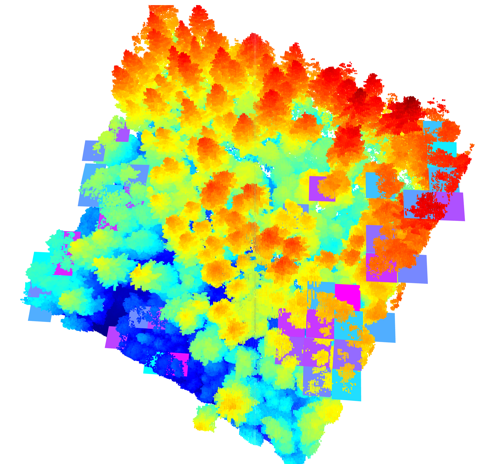

# LOFTY  -LOcalize Flat Topped Trees Yonder
AUTHOR: Georg Strunck @TU Delft, Netherlands

This repository contains a simple Python script to identify the flatter canopy sections of a forest 3D scan. It has been designed for the deployment of the canopy raft used in the [xPrize Rainforest](https://www.xprize.org/prizes/rainforest) finals competition.
It simply works by running a sliding window horizontally over the 3D area and plotting the spread of the uppermost points (canopy section). If these are within a certain flatness the canopy window is deemed flat enough for the deployment of the canopy raft. The GPS coordinates can then be extracted and passed on to the raft-deploying drone for autonomous flight to the deployment site.

The above image shows the better 20\% of tiles, the lighter blue being the flattest sections.
